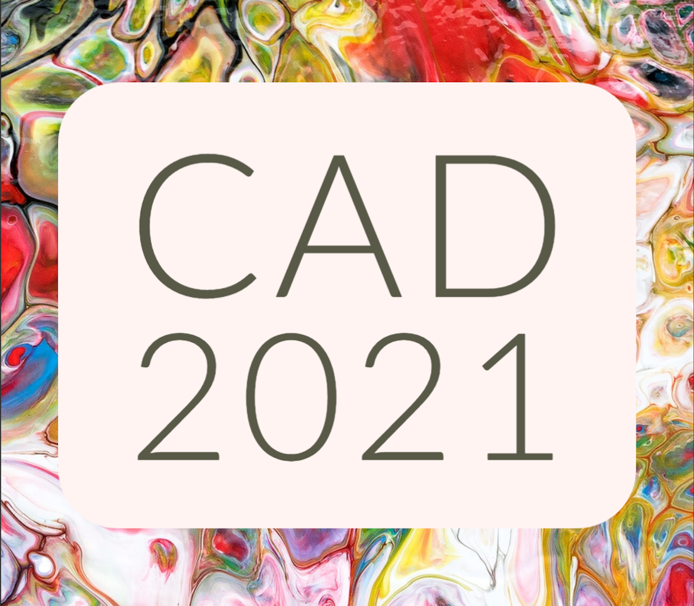

# CAD21@AAAI21 Shared Task on Predicting Emphasis in Presentation Slides

This shared task is part of The AAAI-21 Workshop on Content Authoring and Design (CAD21) workshop.

HomePage: https://ritual.uh.edu/aaai-21-workshop-on-content-authoring-and-design/

CodaLab: https://competitions.codalab.org/competitions/27419

**NOTE: Publishing outside CAD21 on this shared task’s dataset is not allowed until after December 2020. 

